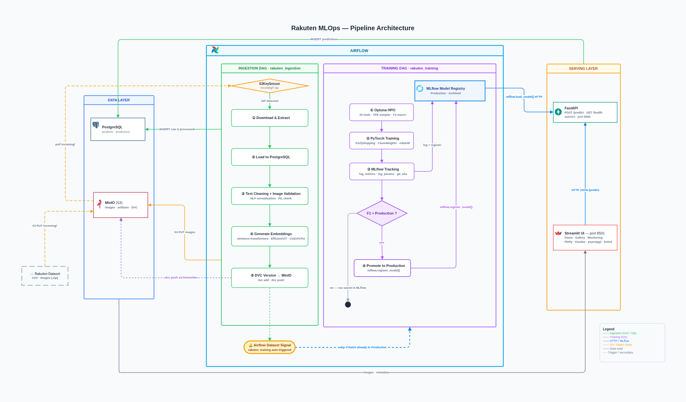
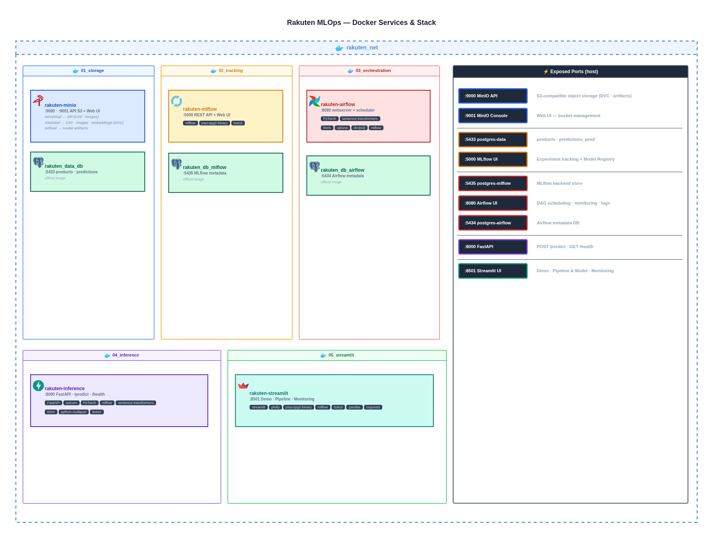
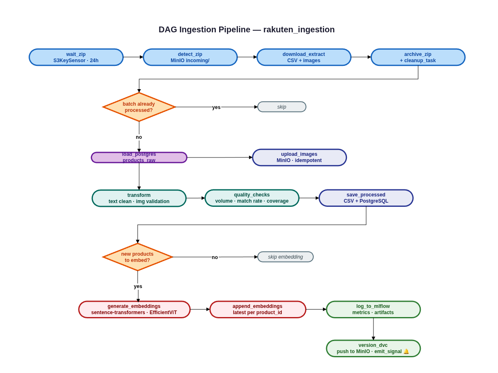
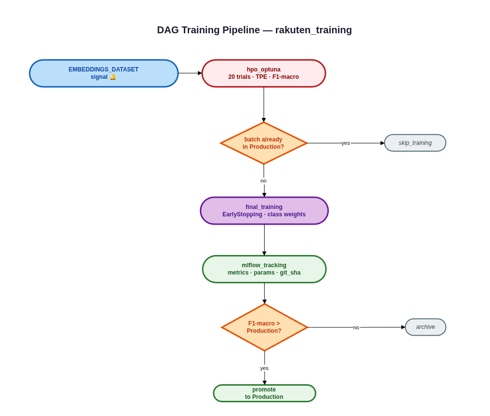
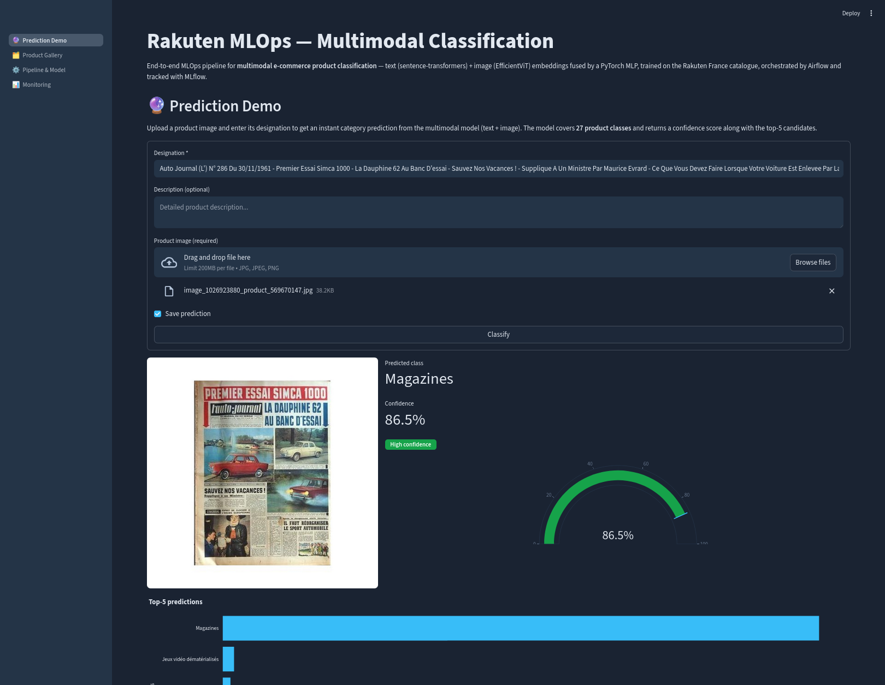
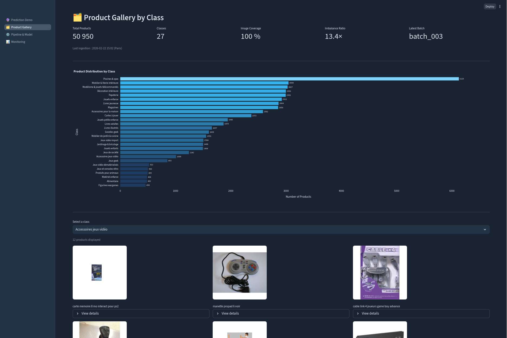
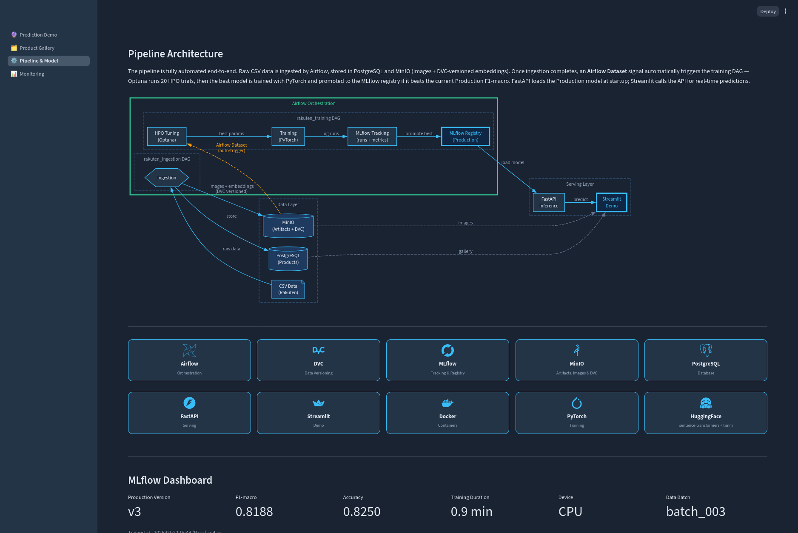
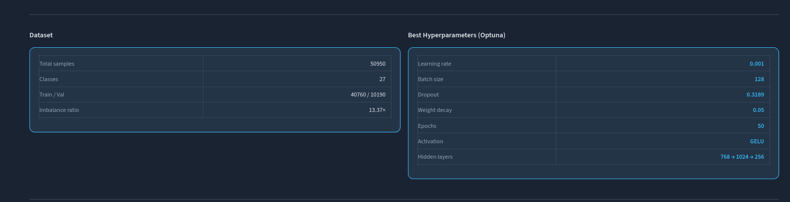
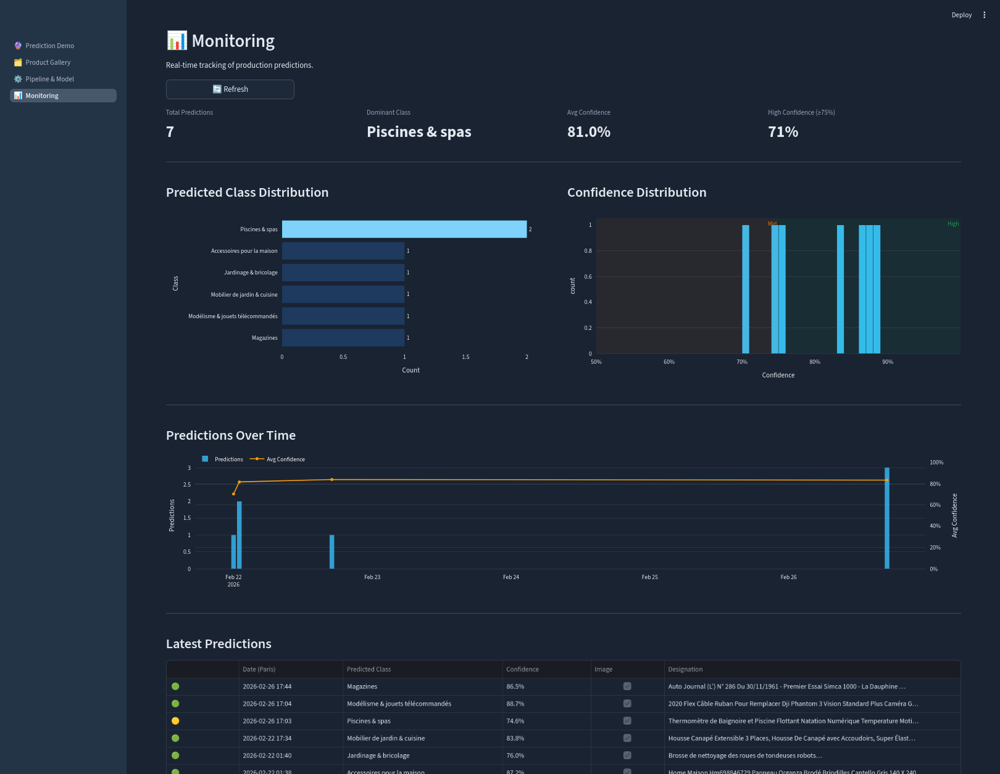

# MultiModalAI MLOps

         

End-to-end MLOps pipeline for multimodal e-commerce product classification (text + image) — ingestion, training, inference and monitoring.

> **27 classes · 50 950 products · F1-macro 0.8188 · imbalance ratio 13.4×**

---

## Overview

This project implements a production-grade MLOps pipeline for classifying Rakuten e-commerce products using both text (designation + description) and image data. The full pipeline — from raw data ingestion to model serving — runs on a single machine via Docker Compose. Hyperparameter optimization is handled by Optuna (20 trials, TPE sampler) with automatic model promotion based on F1-macro.

---

## Architecture

### Pipeline Architecture




### Model

The fusion model combines two pretrained encoders whose weights are **frozen** — only the classification head is trained.

**Text encoder — `OrdalieTech/Solon-embeddings-base-0.1`**
French-optimized sentence-transformers model (CamemBERT-based), chosen for its strong performance on French e-commerce product descriptions. Produces 768-dim embeddings.

**Image encoder — `efficientvit_b2.r288_in1k`** (timm)
Lightweight Vision Transformer optimized for CPU inference. Produces 384-dim embeddings from product images at 224×224.

**Fusion head — `MultimodalMLP`**
Concatenation of both embeddings (1152-dim) passed through 3 fully-connected layers with BatchNorm + activation + dropout, trained with class-weighted cross-entropy and label smoothing.

| Component | Detail |
|---|---|
| Architecture | `MultimodalMLP` — frozen encoders + trainable FC head |
| Input | 1152-dim (image 384 + text 768) |
| Hidden layers | 3 FC blocks with BatchNorm, activation (ReLU/GELU/SiLU), Dropout |
| Hidden dims (best run) | 1024 → 640 → 384 |
| Classes | 27 product categories |
| Optimizer | AdamW + ReduceLROnPlateau + gradient clipping (max_norm=1.0) |
| Loss | CrossEntropyLoss — class weights + label smoothing 0.1 |
| Training metric | **F1-macro** (imbalanced dataset — 13.4× ratio) |

### Services

| Service | Tech | Port (host) | Description |
|---|---|---|---|
| Storage | MinIO | 9000 / 9001 | S3-compatible object store (artifacts, images, DVC) |
| Rakuten DB | PostgreSQL | 5433 | Products, processed data, Optuna storage |
| MLflow DB | PostgreSQL | 5435 | MLflow backend store (dedicated instance) |
| Airflow DB | PostgreSQL | 5434 | Airflow metadata store (dedicated instance) |
| Tracking | MLflow | 5000 | Experiment tracking + model registry |
| Orchestration | Airflow | 8080 | Pipeline DAGs (LocalExecutor) |
| Inference | FastAPI | 8000 | REST API for real-time prediction |
| Demo | Streamlit | 8501 | Interactive UI — demo, gallery, monitoring |

All services communicate over a shared Docker bridge network (`rakuten_net`).

### Docker Services Architecture




---

## Pipeline

### Ingestion DAG (`rakuten_ingestion`)




### Training DAG (`rakuten_training`)

Triggered automatically via [Airflow Datasets](https://airflow.apache.org/docs/apache-airflow/stable/authoring-and-scheduling/datasets.html) when ingestion completes.




### Notable design decisions

- **F1-macro** as primary metric (not accuracy) — 27-class imbalanced dataset (ratio 13.4×)
- **Class weights** computed per batch and applied in CrossEntropyLoss (+ label smoothing 0.1)
- **Optimizer** AdamW + ReduceLROnPlateau (factor 0.5) + gradient clipping (max_norm=1.0)
- **Early stopping** on `val_loss`; best model checkpoint saved independently on `val_f1_macro`
- **HPO** Optuna TPE sampler (20 trials) + MedianPruner — searches lr, dropout, weight_decay, batch_size, hidden dims, activation
- **Deduplication** — latest embedding per `product_id` always wins (new batch overwrites old)
- **Traceability** — each model tagged with `data_run_id` (which batch) + `git_sha` (which code)
- **Auto-promotion** — new version promoted to Production only if F1-macro > current Production; Archived versions cleaned up automatically
- **Idempotency** — ingestion and training can be safely re-run; archive/cleanup always execute even on duplicate batches

---

## Quick Start

### Prerequisites

- Docker + Docker Compose
- 16 GB RAM recommended (PyTorch CPU inference)
- Raw data ZIP placed in MinIO `incoming/` bucket

### 1. Clone & configure

```bash
git clone https://github.com/YBengala/multimodalai-mlops.git
cd multimodalai-mlops
cp .env.example .env   # edit credentials if needed
```

### 2. Create network

```bash
docker network create rakuten_net
```

### 3. Start the stack

```bash
make up
```

| Service | URL |
|---|---|
| Airflow | http://localhost:8080 |
| MLflow | http://localhost:5000 |
| MinIO | http://localhost:9001 |
| FastAPI docs | http://localhost:8000/docs |
| Streamlit | http://localhost:8501 |

### 4. Run the pipeline

1. Upload a data ZIP to MinIO `incoming/` bucket
2. In Airflow UI → enable and trigger `rakuten_ingestion` DAG
3. `rakuten_training` triggers automatically when ingestion completes
4. Once a model is promoted to Production → FastAPI and Streamlit are ready

> **macOS note**: Port 5000 may conflict with AirPlay Receiver.
> Disable via System Settings → General → AirDrop & Handoff → AirPlay Receiver.

### 5. Other commands

```bash
make rebuild  # Rebuild all images (no cache) — run make up afterwards
make down     # Stop stack and remove containers
make logs     # Live logs (Ctrl+C to exit)
make status   # Container status
make config   # Validate Docker Compose configuration
```

---

## Project Structure

```
.
├── dags/                    # Airflow DAGs (ingestion · training · datasets)
├── data/                    # Raw · processed · embeddings (DVC-tracked)
├── docker/
│   ├── 01_storage/          # MinIO + PostgreSQL (Rakuten DB)
│   ├── 02_tracking/         # MLflow + dedicated PostgreSQL
│   ├── 03_orchestration/    # Airflow + dedicated PostgreSQL
│   ├── 04_inference/        # FastAPI
│   └── 05_streamlit/        # Streamlit
├── docs/                    # Architecture diagrams (.drawio + .png)
├── models/                  # Local artifacts + best_hyperparams.joblib
├── src/multimodal_ai/
│   ├── _infra/              # Shared helpers (db · s3 · logging)
│   ├── api/                 # FastAPI endpoints (/predict · /health)
│   ├── config/              # Pydantic settings (all services)
│   ├── features/            # Encoders (train + infer) · embedding builder
│   ├── ingestion/           # Ingestion pipeline + batch guard
│   ├── models/              # MultimodalMLP + FusionEmbeddings
│   ├── streamlit/           # Pages · components · static icons
│   ├── tracking/            # MLflow logging helpers
│   ├── training/            # train · tuning · callbacks
│   ├── transformation/      # Text cleaning · quality checks
│   └── versioning/          # DVC versioning
├── tests/                   # Pytest — 11 test files, fully mocked
├── .env.example
├── Makefile
└── pyproject.toml
```

---

## API

### `POST /predict`

Classifies a product from text and/or image.

```bash
curl -X POST http://localhost:8000/predict \
  -F "designation=Livre de cuisine française" \
  -F "description=250 recettes traditionnelles" \
  -F "image=@product.jpg"
```

**Response**:

```json
{
  "predicted_class": "Livres",
  "confidence": 0.923,
  "top5": [
    {"class": "Livres", "score": 0.923},
    {"class": "Cuisine & Gastronomie", "score": 0.042},
    ...
  ]
}
```

### `GET /health`

```json
{"status": "ok", "model": "Rakuten_Multimodal_Fusion", "version": "2"}
```

---

## Streamlit App

| Page | Description |
|---|---|
| **Prediction Demo** | Real-time classification via FastAPI + similar products gallery |
| **Product Gallery by Class** | Browse products by category with stats and images from MinIO |
| **Pipeline & Architecture** | Pipeline diagram, tech stack, MLflow dashboard (F1 history, hyperparams) |
| **Monitoring** | Production predictions — class distribution, confidence levels, volume over time |

### Prediction Demo


### Product Gallery


### Pipeline & Model



### Monitoring


---


## Roadmap

- Evidently drift monitoring DAG (`monitoring_dag.py`) — detect feature/label drift from production predictions
- Docker image published on GHCR (`ghcr.io/YBengala/multimodalai-mlops/inference:v1.0.0`) via GitHub Actions
- CI/CD pipeline — integration tests, Docker image scanning (Trivy via GitHub Actions), automated rollback


---

## Known Limitations

This project is designed as a portfolio/demo — production hardening would require:

- **Security** — secrets management (Vault), API authentication, HTTPS, network policies
- **Reliability** — CeleryExecutor or KubernetesExecutor, high availability, automated backups
- **Observability** — centralized logging (Loki/ELK), infrastructure metrics (Prometheus + Grafana), alerting
- **Performance** — inference batching, embedding cache, encoder warm-up
- **Data** — schema validation (Great Expectations), PII/GDPR handling

---

## Dataset

[Rakuten France Multimodal Product Classification](https://www.kaggle.com/datasets/evgeniyasergeeva/rakuten-france-multimodal-product-classification) — Kaggle
